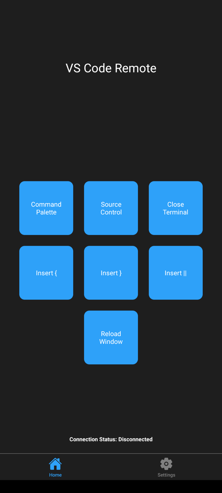

# vscrx

Are you lazy as i am? Don't want to press cmd+shift+p for command palette in VS Code?
Looking for `{}` or `||` on your keyboard?

This app connects to [vscxr](https://github.com/benNurtjipta/vscxr) VS Code extension and lets you execute commands remotely.

More buttons will be added later

